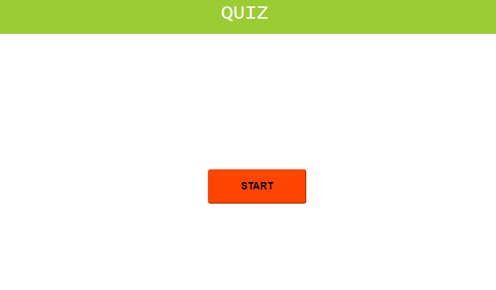
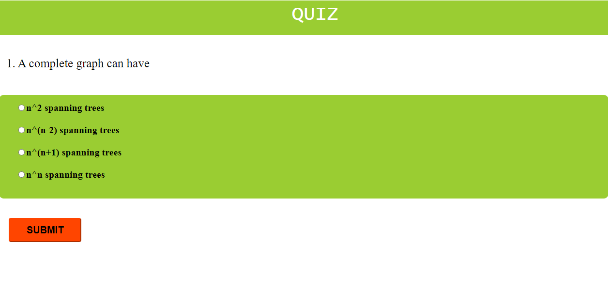
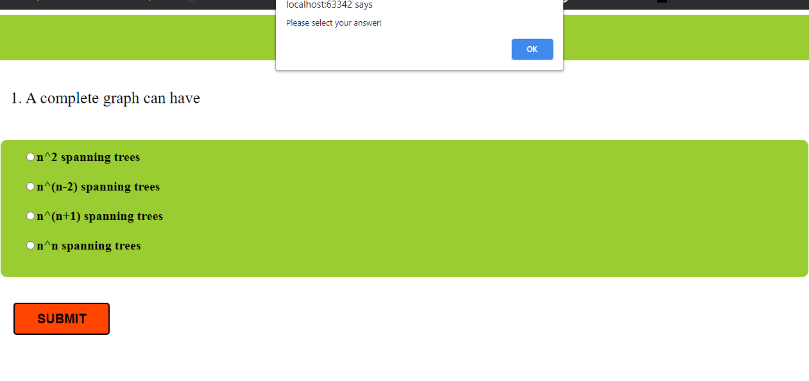
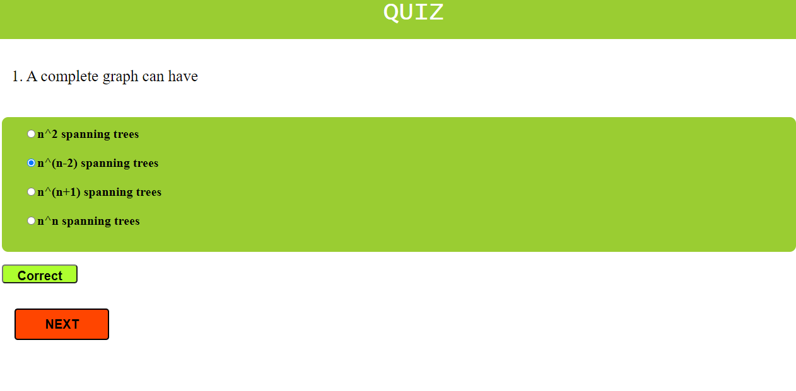
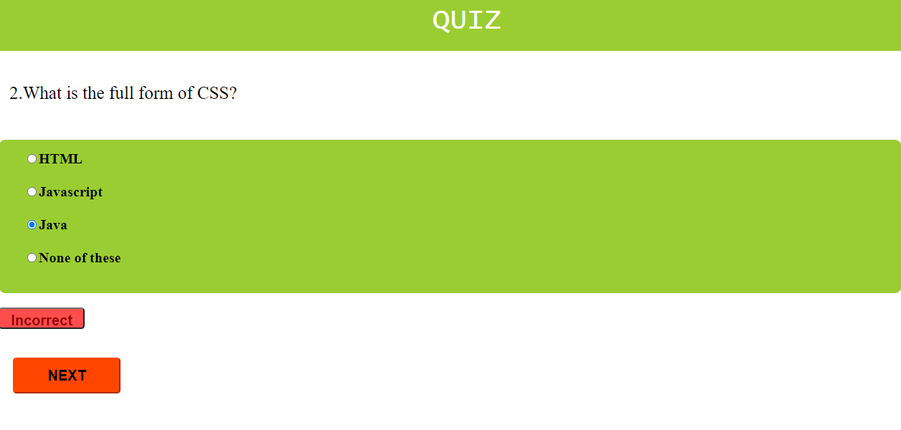
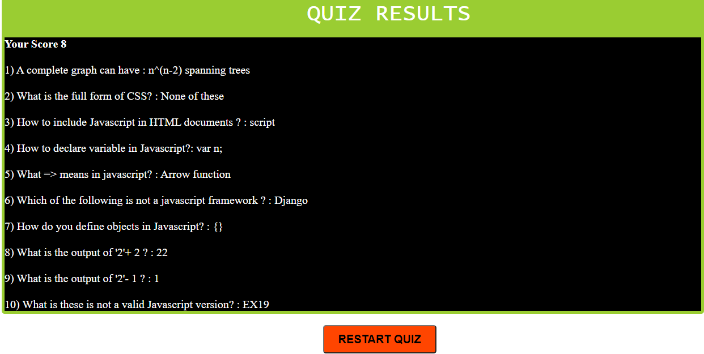

# Live Demo
You can view the live Quiz Module here :  [Quiz Module](https://adishisood.github.io/Quiz-Module/)
# Quiz Module
1) Click on start button to start your quiz

2) Choose an option

3) If user clicks on the submit button without selecting any option it will show a prompt saying 'Please choose an option'.

4) If user gives correct answer, it shows a correct text on screen.

5) If user gives incorrect answer, it shows a incorrect text on screen.

6) After you finish your quiz, your scores and Correct Answers will be displayed on the screen.

### I have Build a basic quiz module by fulfilling the below User stories

**User story 1:** Design a Quiz page that keeps track of scores.

**User story 2:** Create an Array of objects named questions.

**User story 3:** Interface of the object must contain the question title, array of options, correct answer and score.

**User story 4:** Display questions along with options one by one to user and give a button to go to next question.

**User story 5:** In case user gives correct answer, increment scores by the score of the question and also show a correct text on screen, else move the user to next question.

**User story 6:** After all the questions are attempted by the user, show user their score and display the correct answers to them.

**User story 7:** Also give ability to restart the quiz to the user.

**User story 8:** Add atleast 10 questions to quiz along with 4 options.

**User story 9:** Initially show a submit button to user to submit the answer

**User story 10:** If user clicks the submit button without selecting an option show a prompt saying 'Please select an option'.

**User story 11:** After the user successfully submits a question, show him correct or incorrect status and hide the display button and show the next button to go to next question, also disable the input fields before going to next questio
